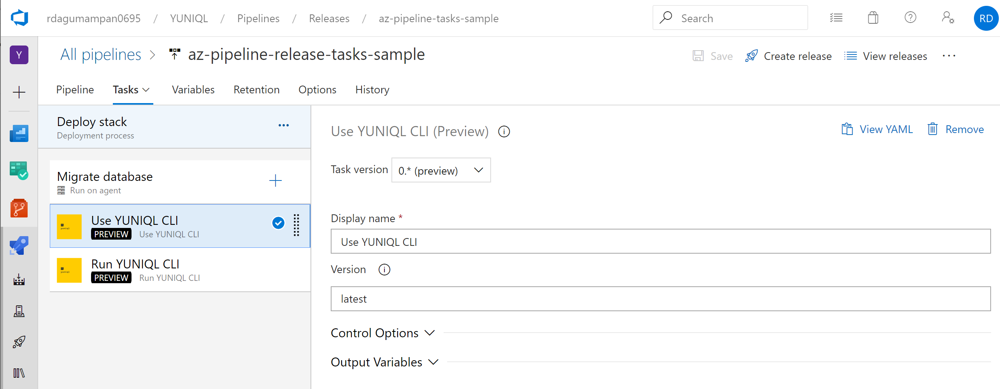
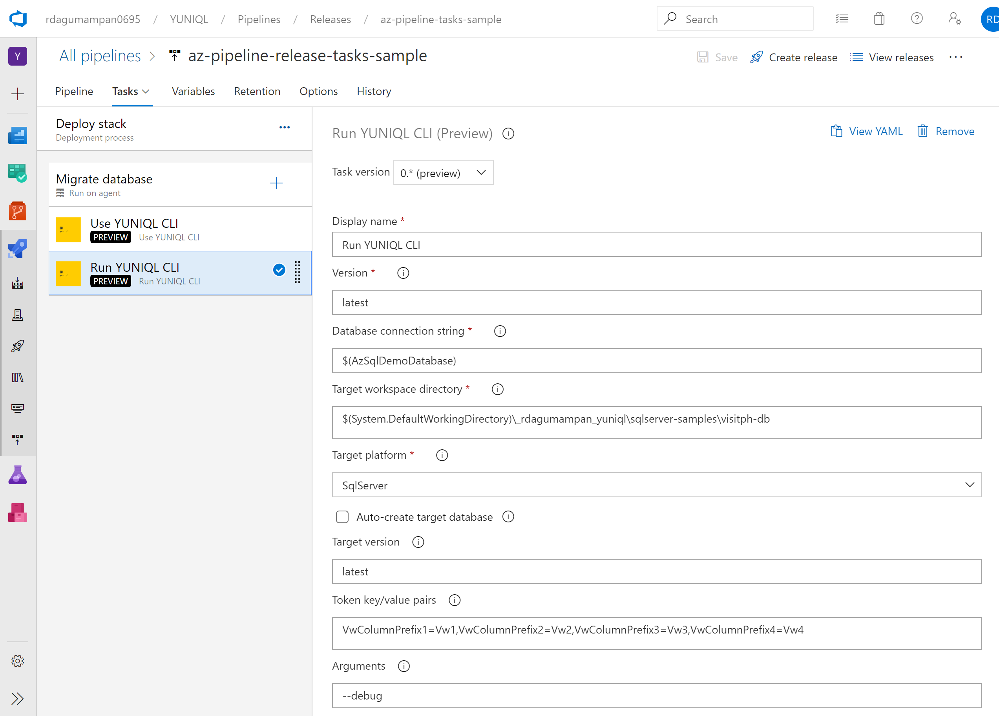

# Yuniql Azure Pipelines Tasks

Run database migrations and schema versioning with Yuniql. Supports SqlServer, PostgreSql, MySql and others. For samples and developer guide, walk through our [wiki documentation](https://github.com/rdagumampan/yuniql/wiki) and bookmark [https://yuniql.io](https://yuniql.io).

**NOTE: This is a PREVIEW RELEASE. Stay tuned for latest features and releases, star or watch project yuniql on Github. See  https://github.com/rdagumampan/yuniql**

### Pre-requisites
* Works only with Windows-based agents for now
* The pipeline tasks requires a yuniql compliant directory structure. To create this structure you may [install yuniql-cli](https://github.com/rdagumampan/yuniql/wiki/Install-yuniql), commit to a git repository and use the repository as input artifact in the pipelines. You may also copy our [existing samples](https://github.com/rdagumampan/yuniql/tree/master/samples) for your target database platform and commit to your own repo.

  

### Azure DevOps YAML Pipelines

``` yaml
trigger:
- master

pool:
  vmImage: 'windows-latest'

steps:
- task: UseYuniqlCLI@0
  inputs:
    version: 'latest'

- task: RunYuniqlCLI@0
  inputs:
    version: 'latest'
    connectionString: 'Server=tcp:<AZ-SQLSERVER>,1433;Initial Catalog=<AZ-SQLDB>;User ID=<USERID>;Password=<PASSWORD>;Encrypt=True;TrustServerCertificate=False;Connection Timeout=30;'
    workspacePath: '$(Build.SourcesDirectory)\samples\basic-sqlserver-sample'
    targetPlatform: 'SqlServer'
    additionalArguments: '--debug'
```

This runs database migration with yuniql-cli.
* `version`: The version of Yuniql CLI. If omitted, the latest version of yuniql-cli is installed. [Visit releases](https://github.com/rdagumampan/yuniql/releases) to get an appropriate version. 
* `connectionString`: The connection string to your target database server.
* `workspacePath`: The location of your version directories to run.
* `targetPlatform`: The target database platform. Default is SqlServer.
* `autoCreateDatabase`: When true, creates and configure the database in the target server for yuniql migrations.
* `targetVersion`: The maximum target database schema version to run to.
* `tokenKeyValuePair`: Token key/value pairs for token replacement.
* `delimiter`: The delimeter to use other than default comma when parsing CSV file.
* `additionalArguments`: Additional CLI arguments such as `--debug` to enable trace message.

### Use Yuniql Task



This downloads and installs the yuniql-cli.
* `Version`: The version of Yuniql CLI. If omitted, the latest version of yuniql-cli is installed. [Visit releases](https://github.com/rdagumampan/yuniql/releases) to get an appropriate version. 

### Run Yuniql Task



### License
Copyright (C) 2019 Rodel E. Dagumampan

Licensed under the Apache License, Version 2.0 (the "License"); you may not use this file except in compliance with the License. You may obtain a copy of the License at http://www.apache.org/licenses/LICENSE-2.0

Unless required by applicable law or agreed to in writing, software distributed under the License is distributed on an "AS IS" BASIS, WITHOUT WARRANTIES OR CONDITIONS OF ANY KIND, either express or implied. See the License for the specific language governing permissions and limitations under the License.

### Found bugs?

Help us improve further please [create an issue](https://github.com/rdagumampan/yuniql/issues/new).